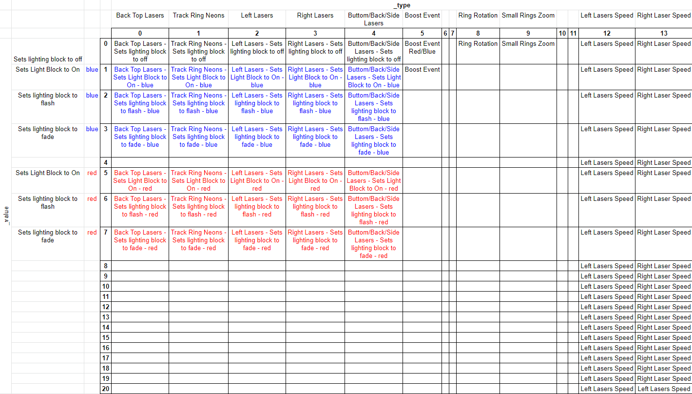
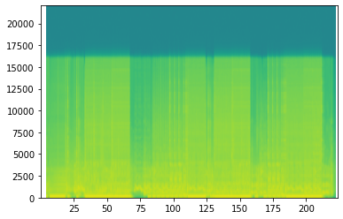

# Beat Saber - Generated Maps Algorythmically, Mostly For Fun, No Profit

There is this [Beat Sage](https://beatsage.com/) map generator powered by AI that seems to be working well. The results looks fun.

Still, I was curious to see if it would be possible to generate maps through probabilities, based on observed patterns from existing maps.

The strategy was to take existing maps, break them into sequences (2 beats per sequence seems like a good balance), take note of which sequence follows which ones, and then randomly generate new maps based on these known patterns.

That worked well, but it felt a bit random and didn't really follow the intensity of the songs I tried it on. When the whole song has about the same intensity level, it doesn't matter, but not for the ones with a drop.

Compared to the Beat Sage AI backed generator, I don't really control what are the potential sequences I am getting at what point in the song, so I kind of have to do my best with what I have.

The following code demonstrates the approach I took. and given that it fits in 23 short blocks of code, and isn't requiring a great amount of GPU processing, I think it's fine for the fun I can get with the result.

In this example, I will use maps created by [Dee-Dee](https://bsaber.com/members/dee-dee/), [Nixie.Korten](https://bsaber.com/members/Nixie.Korten/) and [misterlihao](https://bsaber.com/members/misterlihao/), mainly because their maps tend to have a nice flow. The results will tend to be quite different depending on the tracks that are used for the training. Going all in with all the custom tracks I might have on my computer produced too much randomness, so targeting on a specific style seems to work better.


This notebook generates a map for the song [Big In Japan by Alphaville](https://www.youtube.com/embed/_IYjBCLKmBE). This first version was without the automatic lighting effects.

I also rendered a map for `Maria [I Like It Loud]` by Scooter after adding automatic lighting capabilities. The result can be seen on [Youtube](https://youtu.be/iQaO4YG7Su0)

## How to use this code

[Beastsaber has excellent instructions](https://bsaber.com/getting-started/mapping/) explaining how to prepare an audio file for mapping.

At a high level, the following steps are necessary:
1. Software Setup: Download the necessary tools for mapping: an [audio editor](https://www.audacityteam.org/) and a [map editor](https://bsmg.wiki/mapping/#map-editing-resources).
2. Audio Setup: [Set up your audio file](https://bsmg.wiki/mapping/basic-audio.html), find and confirm the BPM, and export in OGG format.
    * Adding 8 full beat before the song starts gives some time to see the first blocks comming
   
3. Editor Setup & Mapping: Set up your song in your [mapping editor](https://bsmg.wiki/mapping/#community-editors) (we recommend MMA2) and get mapping! Review [basic mapping practices](https://bsmg.wiki/mapping/basic-mapping.html) before you start. [Playtest](https://bsmg.wiki/mapping/#playtesting) your own work early and often.

<- This is where we can insert ourselves in the creation process

4. Lighting: Review [basic lighting information](https://bsmg.wiki/mapping/#lighting-practices). Simple manual lighting is easier than you think!
5. ~Playtesting: Third-party playtesting via the BSMG Discord is highly recommended to get constructive feedback and to get past your own “map blindness.~
6. ~Release Your  Map: Once your song has been mapped, lighted, and playtested you’re ready to release your song to the world on BeatSaver (it will mirror here to BeastSaber in a few minutes).~

^ About the two last steps: the result will be quite random, and not worthy of standing along all the great work from real mappers. 


```python
import json
import random
from os.path import exists
import os
import time
import copy

import numpy as np
import matplotlib.pyplot as plt
import scipy.io.wavfile as wavfile

import math
import soundfile as sf

start_time = time.time()
```

## Configuration

Location of the customeLevels and WIP levels, as well as the difficulty used for training


```python
customLevels_folder = "/mnt/c/Program Files/Oculus/Software/Software/hyperbolic-magnetism-beat-saber/Beat Saber_Data/CustomLevels/"
customWIPLevels_folder = "/mnt/c/Program Files/Oculus/Software/Software/hyperbolic-magnetism-beat-saber/Beat Saber_Data/CustomWIPLevels"

assert exists(customLevels_folder) == True, f"customLevels folder {customLevels_folder} should exists"
assert exists(customWIPLevels_folder) == True, f"customWIPLevels folder {customWIPLevels_folder} should exists"
```

## Songs used for training

For this, I am searching for folders in the customeLevels folder, and uses any song matching one of listed keywords


```python
# MODIFY ME

difficulty = "ExpertStandard.dat"
filters = ["dee", "nixie", "joetastic", "faded", "emir", "ge2toro", "nitronik"]#, "misterlihao"]
```

## Queue of Songs to map

While I define each functions used by this code, I will be using the first entry of the song queue for testing and demonstratation.

In reality, the mapping is done in two parts:
1. Training on existing maps. This only needs to be done once
2. Mapping of new songs.

For this last part, the code will be going through the `song_queues` variable defined in the next cell, and will map each of them.

The reason why I am doing this is that it makes it easier to add a new song to map, while still keeping the parameters of the files I mapped previously.

The difficulty is defined only once, so are the song used for training. Otherwise the code would need to retrain for each songs, which might be suitable if I want to use different style of maps as a template, but is quite time consuming if I am going to try to find the best match against the output audio.

The inconvenient of the current method is that if I train on maps that are inconsistent, so will be the output maps. It's likely that there will be super slow portions, followed by crazy fast sequences because of the sequences used for training.


```python
# MODIFY ME

song_queues = [
    {
        "folder": "Alphaville - Big In Japan - 97.79",
        "first_beat": 16,
        "last_beat": 368,
    },
    {
        "folder": "Vanilla Ice - Ice Ice Baby",
        "first_beat": 8,
        "last_beat": 505,
    }
]
```


```python
# probably ok to leave me unmodified

# uses two beats for one sequence of blocks
# longer sequences (ex.: 4) reduces the randomness since it reduces the potential possibility of 
# chaining sequences
sequence_length = 2

# precision: break each beat in 8 parts. 1/8 of a beat. necessary for fast songs. 
# having this too low could cause block overlay
precision = 16
```


```python
def get_list_map_files(customLevels_folder, filters):
    return sorted(list(set([
        x for x in os.listdir(customLevels_folder)
        if any(y in x.lower() for y in filters)
    ])))


notes_files = get_list_map_files(customLevels_folder, filters)
assert len(notes_files) > 0, "There are no training files. check your `customerLevels_folder`, or your `filters` variable"
print('Number of songs used for training:', len(notes_files))
notes_files
```

    Number of songs used for training: 56


    ['17e36 (PAUSE - nitronik.exe)',
     '1a0b9 (Lone Digger - Nixie.Korten)',
     '1a0be (Wonderland - Nixie.Korten)',
     '1bbb6 (Emir - ROCKSTAR)',
     '1bd21 (Joetastic - KING)',
     '1dc65 (Lost One no Goukoku - Joetastic)',
     '1e06e (Happy Wedding Mae Song - Ge2toro)',
     '20ac4 (About You - DeeDee)',
     '20ac8 (Pepas - Dee-Dee)',
     '20fc6 (Horizon - Ge2toro)',
     '2142b (Graveyard Shift - Ge2toro)',
     '21540 (Toxic - Emir)',
     '22e58 (Tokugawa Cup Noodle Kinshirei - Ge2toro)',
     '22ee8 (Bones - Faded 99)',
     '23372 (IDGAF - Faded 99)',
     '2373d (Boulevard of Broken Dreams - Faded 99)',
     '23af5 (Tada Kimini Hare - Emir)',
     '240f4 (Loco - Dee-Dee)',
     '2466c (Miku - Ge2toro)',
     '249ee (Chitty Chitty Bang Bang (TV Size) - Joetastic)',
     '25a48 (Stop The World - Joetastic)',
     '25a6b (Supersonic - Dee-Dee)',
     '260c8 (I hope you can become an adult someday - Emir)',
     '26407 (So Sick - nitronik.exe)',
     '26408 (Grime Thing - nitronik.exe)',
     '26514 (Solo Mission - Faded 99)',
     '266b3 (Garakuta Doll Play - Ge2toro)',
     '268b0 (WindFall - Emir)',
     '268bf (KEEP ON MOVING - Joetastic)',
     '26f79 (Kernkraft 400 - Faded 99)',
     '270ed (WOW BB - DeeDee)',
     '271da (All Night - Nixie.Korten)',
     '271db (Bom Bom - Nixie.Korten)',
     '271df (Perfume - Nixie.Korten)',
     '271e0 (Light Up The Night - Nixie.Korten)',
     '271e1 (Mr Magpie - Nixie.Korten)',
     '271e4 (Wake Up Romeo - Nixie.Korten)',
     '27278 (Shichiten Hakki Shijou Shugi! - Ge2toro)',
     '27a7d (Calabria - DeeDee)',
     '27ad9 (Symphony - Lekrkoekj & Faded99)',
     '27bfa (Stressed Out (2022 Remap) - Joetastic)',
     '27bfe (Jump Around - Pixelguy & nitronik.exe)',
     '27ca1 (Levitate - nitronik.exe)',
     '27ca3 (Low - nitronik.exe)',
     '27ca5 (No Time - nitronik.exe)',
     '27ea9 (純透明少年 Semi-Transparent boy - Emir)',
     '27f46 (Makudonarudo (Tokyo bon) - Emir)',
     '2810b (Viva La Vida (2022 Remap) - Joetastic)',
     '284dd (Younger - Faded 99)',
     '2867e (1 2 Fanclub - Joetastic)',
     '288a0 (Speechless - Joetastic & RealCoda)',
     '4481 (Barbra Streisand - Joetastic)',
     '65c9 (Sweet Dreams (Are Made Of This) - Joetastic)',
     '75a8 (Silhouette (TV Size) - Joetastic)',
     'b5ff (Sakuranbo - Emir)',
     'c213 (Rhythm Is A Dancer - nitronik.exe)']


## Confirming configurations


```python
def open_file_info(current, customWIPLevels_folder):
    output_file = "{}/{}/{}".format(customWIPLevels_folder, current['folder'], difficulty)
    output_info_dat_file = "{}/{}/Info.dat".format(customWIPLevels_folder, current['folder'])
    assert exists(output_info_dat_file), f"info file should exists in the song_output_folder" 
    assert exists(output_file), f"output file {current['folder']}/{difficulty} should exist"

    new_config = copy.copy(current)
    
    with open(output_info_dat_file) as f:
        song_key = "_songFilename"
        bpm_key = "_beatsPerMinute"
        song_file_key = "_songFilename"
        info_dat = json.load(f)
        song_file_name = info_dat[song_file_key]
        audio_file = "{}/{}/{}".format(customWIPLevels_folder, current['folder'], song_file_name)
        
        new_config['config'] = {
            'output_file': output_file,
            'output_info_dat_file': output_info_dat_file,
            'info_dat': info_dat,
            'song_key': song_key,
            'bpm_key': bpm_key,
            'song_file_key': song_file_key,
            'song_file_name': song_file_name,
            'audio_file': audio_file
        }
        
        return new_config

current1 = open_file_info(song_queues[0], customWIPLevels_folder)

# print("* checking that the song file exists in the song_output_folder")
assert exists(current1['config']['audio_file']), f"song file {current1['config']['info_dat']['song_file_key']} should exist"

# print("* checking that the _beatsPerMinute value is configured")
assert current1['config']['bpm_key'] in current1['config']['info_dat'].keys(), f"key {current1['config']['bpm_key']} should be in current1['config']['info_dat'].keys(): {current1['config']['bpm_key'] in current1['config']['info_dat'].keys()}"
assert current1['config']['info_dat']["_beatsPerMinute"] > 0.0, f"{current1['config']['bpm_key']} should have a value greater than zero: {info_dat[bpm_key]}"

# the info.dat file looks like this
current1['config']['info_dat']
```


    {'_version': '2.0.0',
     '_songName': 'Big In Japan',
     '_songSubName': '',
     '_songAuthorName': 'Alphaville',
     '_levelAuthorName': 'unknow',
     '_beatsPerMinute': 97.79000091552734,
     '_shuffle': 0,
     '_shufflePeriod': 0.5,
     '_previewStartTime': 12,
     '_previewDuration': 10,
     '_songFilename': 'song.ogg',
     '_coverImageFilename': 'cover.jpg',
     '_environmentName': 'PanicEnvironment',
     '_songTimeOffset': 0,
     '_customData': {'_contributors': [],
      '_editors': {'MMA2': {'version': '4.8.4'}, '_lastEditedBy': 'MMA2'}},
     '_difficultyBeatmapSets': [{'_beatmapCharacteristicName': 'Standard',
       '_difficultyBeatmaps': [{'_difficulty': 'Expert',
         '_difficultyRank': 7,
         '_beatmapFilename': 'ExpertStandard.dat',
         '_noteJumpMovementSpeed': 16,
         '_noteJumpStartBeatOffset': 0,
         '_customData': {'_editorOffset': 0,
          '_editorOldOffset': 0,
          '_warnings': [],
          '_information': [],
          '_suggestions': [],
          '_requirements': []}}]}]}


## How Blocks Are Encoded

ExpertStandard.dat is a JSON file, and contains multiple sections. The one that is interesting is the "_notes" section, which contains a long series of entries like the folowing:


```python
sample_block = {
  "_time" : 25.5,
  "_lineIndex" : 3,
  "_lineLayer" : 1,
  "_type" : 1,
  "_cutDirection" : 0
}
```

The `_time` key identifies the beat where that specific entry will show up.

The following lines are a bit more cryptic, but here is a lookup table, and with which charactor I translate them when I flatten each block for processing.


Columns. translated by the idx directly
* _lineIndex: 0 "far left column"
* _lineIndex: 1 "center left column"
* _lineIndex: 2 "center right column"
* _lineIndex: 3 "far right column"

Layer. translated by the first column of letters on my keyboard
* _lineLayer: 0 "bottom" "z"
* _lineLayer: 1 "middle" "a"
* _lineLayer: 2 "top" "q"

Block type. 
* _type: 0 "red" "r"
* _type: 1 "blue" "b"
* _type: 3 "bomb" "x"

Cut Direction. I don't have a numeric keypad on my keyboard, so I used the left secton to represent them.
* _cutDirection: 0 "up" w
* _cutDirection: 1 "down" x
* _cutDirection: 2 "left" a
* _cutDirection: 3 "right" d
* _cutDirection: 4 "up left"  q
* _cutDirection: 5 "up right" e
* _cutDirection: 6 "down left" z
* _cutDirection: 7 "down right" c
* _cutDirection: 8 "all" s


## How Lighting is encoded

The lighting track (`_events` key in the ExpertStandard.dat JSON file) is a lot more complex than the `_notes` track.

A single lighting event looks like this:


```python
sample_light = {
    "_time": 52.5,
    "_type": 1,
    "_value": 5,
}
```

The pairs of `_type` and `_value` maps to specific conditions, which looks like this



A major difference with the blocks is that some of these lights are toggles. They will go on, and stay on until they are turned off, which makes it harder train on since a certain light might be turned off a few sequences later, completely out of context with when it was activated.

## Function that translates the nodes into a pattern string


```python
layer = "zaq"
colour = "rb?x"
cut_dir = "wxadqezcs"

lighting_type = "abcdefghijklmnopqrstuvwxyz1234567890ABCDEFGHIJKLMNOPQRSTUVWXYZ"
lighting_value = "abcdefghijklmnopqrstuvwxyz1234567890ABCDEFGHIJKLMNOPQRSTUVWXYZ"

def encode_block(note, light):
    global layer, colour, cut_dir, lighting_type, lighting_value
    
    seq = (
        str(note["_lineIndex"]) 
        + layer[note["_lineLayer"]] 
        + colour[note["_type"]] 
        + cut_dir[note["_cutDirection"]]
    )

    if light != False:
        seq = seq + lighting_type[light['_type']] + lighting_value[min(light['_value'], len(lighting_value)-1)]
    else:
        seq = seq + lighting_type[random.randint(0,5)] + lighting_value[0]
    
    return seq

def decode_pattern(base, precision, seq):
    global layer, colour, cut_dir
    seqs = json.loads(seq)
    outputs = [] 
    
    for i in range(len(seqs)):
        for j in range(len(seqs[i])):
            outputs.append({
                "_time": base+(i/precision),
                "_lineIndex": int(seqs[i][j][0]),
                "_lineLayer": layer.index(seqs[i][j][1]),
                "_type": colour.index(seqs[i][j][2]),
                "_cutDirection":  cut_dir.index(seqs[i][j][3])            
            })
    return outputs

def decode_lighting(base, precision, seq):
    global lighting_type, lighting_value
    seqs = json.loads(seq)
    lights = []
    
    for i in range(len(seqs)):
        for j in range(len(seqs[i])):
            lights.append({
                "_time": base+(i/precision),
                "_type": lighting_type.index(seqs[i][j][4]),
                "_value": lighting_value.index(seqs[i][j][5])
            })
    return lights

assert encode_block(sample_block, sample_light) == "3abwbf", f"the output from encoding isn't matching expectations"
assert json.dumps(decode_pattern(sample_block['_time'], precision, '[["3abwbf"]]')) == json.dumps([sample_block]), f"decoded pattern isn't matching the original block"
assert json.dumps(decode_lighting(sample_light['_time'], precision, '[["3abwbf"]]')) == json.dumps([sample_light]), f"decoded pattern isn't matching the original block"

```

## Training functions


```python
# received a track sequence, non encoded in json, returns the last part encoded in a json string
def extract_last_pattern(seq, sequence_length, precision):
    return json.dumps(seq[-(sequence_length * precision):])

def count_patterns(sequence):
    return len(sequence)

def remember_patterns(track, sequence_length, precision, track_name = ""):
    global following
    
    previous_pattern = ""

    for i in range(len(track)):
        current_pattern = json.dumps(track[i])
        
        if previous_pattern not in following.keys():
            following[previous_pattern] = []

        if count_patterns(track[i]) > 0:
            following[previous_pattern].append(current_pattern)     
            previous_pattern = current_pattern 

def give_me_following(full_encoded_seq, sequence_length, precision):
    decoded_seq = json.loads(full_encoded_seq)
    
    last_pattern = extract_last_pattern(decoded_seq, sequence_length, precision)
    
    return last_pattern
```

## File processing functions


```python
def read_track_file(base_folder, song_output_folder, difficulty_file):
    filename = "{}/{}/{}".format(base_folder, song_output_folder, difficulty_file)
    
    if exists(filename):
        with open(filename) as f:
            return json.load(f)
    
    print("File '{}/{}' not found. skipping folder".format(song_output_folder, difficulty_file))
    return False

def find_lighting_for_note(lightings, t):
    for event in lightings:
        if event['_time'] > t:
            return False
        elif event['_time'] == t:
            return event
    
    return False

def convert_json_to_patterns(file, sequence_length, precision, content):
    if "_notes" not in content.keys() or "_events" not in content.keys():
        print("* this is a new song:", file)
        print(content.keys())
        return False
    
    first_note = math.floor(content["_notes"][0]["_time"])
    last_note = content["_notes"][-1]["_time"]
    
    nb_sequence = int(((last_note - first_note)) / sequence_length)+1
    
    print("file: {}, first_note: {}, last_note: {}, precision: {}, nb_sequences: {}".format(
        file, first_note, last_note, precision, nb_sequence
    ))
    
    # initializing an empty list that will keep track of the notes
    track = [[[] for y in range(sequence_length * precision)] for x in range(int(nb_sequence))]
    
    for note, block in enumerate(content["_notes"]):
        index = int(block["_time"])
        subindex = int((block["_time"] - index) * precision)
        idx = (index - first_note) * precision + subindex
        seq = idx//(sequence_length*precision)
        pos = idx%(sequence_length*precision)

        encoded = encode_block(block, find_lighting_for_note(content["_events"], block["_time"]))
        try:
            track[seq][pos].append(encoded)
        except:
            print(filename, note, seq, pos, idx, block)
            raise
            
    return track
        

def process_file(folder, file, difficulty, precision, sequence_length):
    notes_json = read_track_file(folder, file, difficulty)
    
    if notes_json != False:
        track = convert_json_to_patterns(file, sequence_length, precision, notes_json)        
        
        if track != False:
            remember_patterns(track, sequence_length, precision, file)
```

## Song processing

This section goes through all training files and register transitions in the `following` global variable.


```python
following = {}

for file in notes_files:
    process_file(customLevels_folder, file, difficulty, precision, sequence_length)
```

    file: 17e36 (PAUSE - nitronik.exe), first_note: 4, last_note: 254, precision: 16, nb_sequences: 126
    file: 1a0b9 (Lone Digger - Nixie.Korten), first_note: 4, last_note: 347.5, precision: 16, nb_sequences: 172
    file: 1a0be (Wonderland - Nixie.Korten), first_note: 15, last_note: 323.25, precision: 16, nb_sequences: 155
    file: 1bbb6 (Emir - ROCKSTAR), first_note: 6, last_note: 470.75, precision: 16, nb_sequences: 233
    file: 1bd21 (Joetastic - KING), first_note: 5, last_note: 373.4986877441406, precision: 16, nb_sequences: 185
    file: 1dc65 (Lost One no Goukoku - Joetastic), first_note: 6, last_note: 284.875, precision: 16, nb_sequences: 140
    File '1e06e (Happy Wedding Mae Song - Ge2toro)/ExpertStandard.dat' not found. skipping folder
    file: 20ac4 (About You - DeeDee), first_note: 3, last_note: 367, precision: 16, nb_sequences: 183
    file: 20ac8 (Pepas - Dee-Dee), first_note: 5, last_note: 613, precision: 16, nb_sequences: 305
    file: 20fc6 (Horizon - Ge2toro), first_note: 4, last_note: 622, precision: 16, nb_sequences: 310
    file: 2142b (Graveyard Shift - Ge2toro), first_note: 4, last_note: 528, precision: 16, nb_sequences: 263
    file: 21540 (Toxic - Emir), first_note: 8, last_note: 479.0625, precision: 16, nb_sequences: 236
    file: 22e58 (Tokugawa Cup Noodle Kinshirei - Ge2toro), first_note: 7, last_note: 601, precision: 16, nb_sequences: 298
    file: 22ee8 (Bones - Faded 99), first_note: 3, last_note: 298.016, precision: 16, nb_sequences: 148
    file: 23372 (IDGAF - Faded 99), first_note: 3, last_note: 226, precision: 16, nb_sequences: 112
    file: 2373d (Boulevard of Broken Dreams - Faded 99), first_note: 4, last_note: 719.094, precision: 16, nb_sequences: 358
    file: 23af5 (Tada Kimini Hare - Emir), first_note: 7, last_note: 463, precision: 16, nb_sequences: 229
    file: 240f4 (Loco - Dee-Dee), first_note: 4, last_note: 480, precision: 16, nb_sequences: 239
    file: 2466c (Miku - Ge2toro), first_note: 5, last_note: 311, precision: 16, nb_sequences: 154
    file: 249ee (Chitty Chitty Bang Bang (TV Size) - Joetastic), first_note: 3, last_note: 187, precision: 16, nb_sequences: 93
    * this is a new song: 25a48 (Stop The World - Joetastic)
    dict_keys(['version', 'bpmEvents', 'rotationEvents', 'colorNotes', 'bombNotes', 'obstacles', 'sliders', 'burstSliders', 'waypoints', 'basicBeatmapEvents', 'colorBoostBeatmapEvents', 'lightColorEventBoxGroups', 'lightRotationEventBoxGroups', 'basicEventTypesWithKeywords', 'useNormalEventsAsCompatibleEvents', 'customData'])
    file: 25a6b (Supersonic - Dee-Dee), first_note: 12, last_note: 380, precision: 16, nb_sequences: 185
    file: 260c8 (I hope you can become an adult someday - Emir), first_note: 7, last_note: 509, precision: 16, nb_sequences: 252
    file: 26407 (So Sick - nitronik.exe), first_note: 4, last_note: 292.5, precision: 16, nb_sequences: 145
    file: 26408 (Grime Thing - nitronik.exe), first_note: 4, last_note: 326, precision: 16, nb_sequences: 162
    file: 26514 (Solo Mission - Faded 99), first_note: 3, last_note: 370.75, precision: 16, nb_sequences: 184
    file: 266b3 (Garakuta Doll Play - Ge2toro), first_note: 36, last_note: 417.8333740234375, precision: 16, nb_sequences: 191
    file: 268b0 (WindFall - Emir), first_note: 10, last_note: 746, precision: 16, nb_sequences: 369
    file: 268bf (KEEP ON MOVING - Joetastic), first_note: 4, last_note: 372, precision: 16, nb_sequences: 185
    file: 26f79 (Kernkraft 400 - Faded 99), first_note: 4, last_note: 344, precision: 16, nb_sequences: 171
    file: 270ed (WOW BB - DeeDee), first_note: 3, last_note: 404, precision: 16, nb_sequences: 201
    file: 271da (All Night - Nixie.Korten), first_note: 4, last_note: 335, precision: 16, nb_sequences: 166
    file: 271db (Bom Bom - Nixie.Korten), first_note: 4, last_note: 355.667, precision: 16, nb_sequences: 176
    file: 271df (Perfume - Nixie.Korten), first_note: 6, last_note: 606, precision: 16, nb_sequences: 301
    file: 271e0 (Light Up The Night - Nixie.Korten), first_note: 4, last_note: 475.5, precision: 16, nb_sequences: 236
    file: 271e1 (Mr Magpie - Nixie.Korten), first_note: 4, last_note: 416, precision: 16, nb_sequences: 207
    file: 271e4 (Wake Up Romeo - Nixie.Korten), first_note: 4, last_note: 362, precision: 16, nb_sequences: 180
    file: 27278 (Shichiten Hakki Shijou Shugi! - Ge2toro), first_note: 6, last_note: 570.75, precision: 16, nb_sequences: 283
    file: 27a7d (Calabria - DeeDee), first_note: 4, last_note: 264.281, precision: 16, nb_sequences: 131
    file: 27ad9 (Symphony - Lekrkoekj & Faded99), first_note: 6, last_note: 517.5, precision: 16, nb_sequences: 256
    file: 27bfa (Stressed Out (2022 Remap) - Joetastic), first_note: 7, last_note: 569.0850219726562, precision: 16, nb_sequences: 282
    file: 27bfe (Jump Around - Pixelguy & nitronik.exe), first_note: 19, last_note: 434, precision: 16, nb_sequences: 208
    file: 27ca1 (Levitate - nitronik.exe), first_note: 4, last_note: 439, precision: 16, nb_sequences: 218
    file: 27ca3 (Low - nitronik.exe), first_note: 4, last_note: 356, precision: 16, nb_sequences: 177
    file: 27ca5 (No Time - nitronik.exe), first_note: 6, last_note: 394, precision: 16, nb_sequences: 195
    file: 27ea9 (純透明少年 Semi-Transparent boy - Emir), first_note: 8, last_note: 913.5, precision: 16, nb_sequences: 453
    file: 27f46 (Makudonarudo (Tokyo bon) - Emir), first_note: 6, last_note: 401.667, precision: 16, nb_sequences: 198
    * this is a new song: 2810b (Viva La Vida (2022 Remap) - Joetastic)
    dict_keys(['version', 'bpmEvents', 'rotationEvents', 'colorNotes', 'bombNotes', 'obstacles', 'sliders', 'burstSliders', 'waypoints', 'basicBeatmapEvents', 'colorBoostBeatmapEvents', 'lightColorEventBoxGroups', 'lightRotationEventBoxGroups', 'basicEventTypesWithKeywords', 'useNormalEventsAsCompatibleEvents', 'customData'])
    file: 284dd (Younger - Faded 99), first_note: 2, last_note: 351.333, precision: 16, nb_sequences: 175
    file: 2867e (1 2 Fanclub - Joetastic), first_note: 10, last_note: 291, precision: 16, nb_sequences: 141
    * this is a new song: 288a0 (Speechless - Joetastic & RealCoda)
    dict_keys(['version', 'bpmEvents', 'rotationEvents', 'colorNotes', 'bombNotes', 'obstacles', 'sliders', 'burstSliders', 'waypoints', 'basicBeatmapEvents', 'colorBoostBeatmapEvents', 'lightColorEventBoxGroups', 'lightRotationEventBoxGroups', 'basicEventTypesWithKeywords', 'useNormalEventsAsCompatibleEvents', 'customData'])
    File '4481 (Barbra Streisand - Joetastic)/ExpertStandard.dat' not found. skipping folder
    file: 65c9 (Sweet Dreams (Are Made Of This) - Joetastic), first_note: 5, last_note: 437.1773681640625, precision: 16, nb_sequences: 217
    File '75a8 (Silhouette (TV Size) - Joetastic)/ExpertStandard.dat' not found. skipping folder
    file: b5ff (Sakuranbo - Emir), first_note: 13, last_note: 659.6091918945312, precision: 16, nb_sequences: 324
    file: c213 (Rhythm Is A Dancer - nitronik.exe), first_note: 4, last_note: 471.25, precision: 16, nb_sequences: 234


## Audio File Analysis

This sections is an attempt to naively detect variations in the song. Using these variations, we can compare them against potential following sequences of blocks, and see which one might be a better fit given the density of the noise.


```python
def load_audio(audio_file):
    audio_file_wav = audio_file + ".wav"

    data, samplerate = sf.read(audio_file)
    if not exists(audio_file_wav):
        sf.write(audio_file_wav, data, samplerate)

    Fs, aud = wavfile.read(audio_file_wav)

    # once the audio file is processed, we don't need the wave file anymore.
    if exists(audio_file_wav):
        os.remove(audio_file_wav)
    return (Fs, aud)


Fs, aud = load_audio(current1['config']['audio_file'])
assert Fs == 44100, f"Audio File ${current1['config']['audio_file']} converted to wave is not 44100hz"
assert len(aud) > 0, f"Audio extract is empty"

print(Fs, len(aud))
```

    44100 10313147


## spectogram of the left channel


```python
def get_rythme(current, Fs, aud):
    song_bpm = current["_beatsPerMinute"]
    rythme = {
        'song_bpm': song_bpm,
        'song_bps': song_bpm/60,
        'song_spb': 60/song_bpm,
        'sample_per_beat': int(Fs * 60/song_bpm),
        'audio': aud[:,0] # select left channel only
    }
    powerSpectrum, frequenciesFound, time_val, imageAxis = plt.specgram(rythme['audio'], Fs=Fs)
    plt.show()
    
    return rythme

rythme = get_rythme(current1['config']['info_dat'], Fs, aud)
assert rythme['song_bpm'] > 0, "Song bpm should be greater than 0"
assert rythme['sample_per_beat'] > 0, "sample_per_beat should be greater than 0"
assert len(rythme['audio']) > 0, "rythme['audio'] should contain the decoded audio track"

print(f"Folder: {current1['folder']}")
print(f"file: {current1['config']['song_file_name']}")
print(f"bpm: {rythme['song_bpm']}")
print(f"bps: {rythme['song_bps']}")
print(f"seconds per beat: {rythme['song_spb']}")
print(f"audio samples per beat: {rythme['sample_per_beat']}")
```

    /home/simon/.virtualenvs/py38/lib/python3.8/site-packages/matplotlib/axes/_axes.py:7553: RuntimeWarning: divide by zero encountered in log10
      Z = 10. * np.log10(spec)


    

    


    Folder: Alphaville - Big In Japan - 97.79
    file: song.ogg
    bpm: 97.79000091552734
    bps: 1.6298333485921224
    seconds per beat: 0.6135596629335244
    audio samples per beat: 27057


```python
def get_audio_ranges(aud_left, sample_per_beat, precision):
    positive_aud_left = [abs(x) for x in aud_left]

    range3 = max(positive_aud_left)
    range0 = range3 // 10

    break_down = []

    for beat in range(int(len(positive_aud_left)/sample_per_beat)):
        for p in range(precision):
            boundary_left = int((beat * sample_per_beat) + (p * (sample_per_beat/precision)))
            boundary_right = int(boundary_left + ((p+1) * (sample_per_beat/precision)))

            noise_left = int(np.mean(positive_aud_left[boundary_left:boundary_right]))

            break_down.append(int(noise_left//range0))
            
    return range0, range3, break_down

range0, range3, break_down = get_audio_ranges(rythme['audio'], rythme['sample_per_beat'], precision)
assert range0 > 0, "range0 should be greater than 0"
assert range3 > 0, "range3 should be greater than 0"
assert len(break_down) > 0, "the break_down variable should not be empty"
```


```python
print(range0, range3) 
```

    2553 25536


```python
def trim_audio(breakdown, current, precision):
    print(current['first_beat'], current['last_beat'])
    return break_down[current['first_beat']*precision:]

trimmed_intensity = trim_audio(break_down, current1, precision)
assert len(trimmed_intensity) < len(break_down), "trimmed_intensity should be smaller than break_down"
```

    16 368


```python
print('beginning...')
print(break_down[:current1['first_beat']*(precision)], '*', break_down[current1['first_beat']*precision:(current1['first_beat']*sequence_length*precision)])
print('...end')
print(break_down[-(current1['last_beat']*precision):current1['last_beat']], '*', break_down[-current1['last_beat']:])

```

    beginning...
    [0, 0, 0, 0, 0, 0, 0, 0, 0, 0, 0, 0, 0, 0, 0, 0, 0, 0, 0, 0, 0, 0, 0, 0, 0, 0, 0, 0, 0, 0, 0, 0, 0, 0, 0, 0, 0, 0, 0, 0, 0, 0, 0, 0, 0, 0, 0, 0, 0, 0, 0, 0, 0, 0, 0, 0, 0, 0, 0, 0, 0, 0, 0, 0, 0, 0, 0, 0, 0, 0, 0, 0, 0, 0, 0, 0, 0, 0, 0, 0, 0, 0, 0, 0, 0, 0, 0, 0, 0, 0, 0, 0, 0, 0, 0, 0, 0, 0, 0, 0, 0, 0, 0, 0, 0, 0, 0, 0, 0, 0, 0, 0, 0, 0, 0, 0, 0, 0, 0, 0, 0, 0, 0, 0, 0, 0, 0, 0, 0, 0, 0, 0, 0, 0, 0, 0, 0, 0, 0, 0, 0, 0, 0, 0, 0, 0, 0, 0, 0, 0, 0, 0, 0, 0, 0, 0, 0, 0, 0, 0, 0, 0, 0, 0, 0, 0, 0, 0, 0, 0, 0, 0, 0, 0, 0, 0, 0, 0, 0, 0, 0, 0, 0, 0, 0, 0, 0, 0, 0, 0, 0, 0, 1, 0, 0, 0, 0, 0, 0, 0, 0, 0, 0, 0, 0, 0, 0, 0, 0, 0, 0, 0, 0, 0, 0, 0, 0, 0, 0, 0, 0, 0, 0, 0, 0, 0, 0, 0, 0, 0, 0, 0, 0, 0, 0, 0, 0, 0, 0, 0, 0, 0, 0, 0, 0, 0, 0, 0, 0, 0, 0, 0, 0, 0, 1, 1] * [2, 1, 1, 0, 0, 0, 0, 1, 1, 1, 1, 1, 1, 1, 1, 1, 3, 1, 1, 1, 1, 1, 1, 1, 1, 1, 1, 1, 1, 1, 1, 1, 3, 1, 1, 1, 0, 0, 0, 0, 1, 1, 1, 1, 1, 1, 1, 1, 3, 1, 1, 0, 1, 1, 1, 1, 1, 1, 1, 1, 1, 1, 1, 1, 3, 1, 1, 1, 1, 1, 1, 1, 1, 1, 1, 1, 1, 1, 1, 1, 4, 1, 1, 1, 1, 1, 1, 1, 1, 1, 1, 1, 1, 1, 1, 1, 3, 1, 1, 0, 0, 0, 0, 0, 1, 1, 1, 1, 1, 1, 1, 1, 3, 2, 1, 0, 1, 1, 1, 1, 1, 1, 1, 1, 1, 1, 1, 1, 3, 1, 1, 1, 1, 1, 1, 1, 1, 1, 1, 1, 1, 1, 1, 1, 4, 2, 1, 1, 1, 1, 1, 1, 1, 1, 1, 1, 1, 1, 1, 1, 3, 1, 1, 1, 1, 0, 0, 1, 1, 1, 1, 1, 1, 1, 1, 1, 4, 1, 1, 0, 0, 1, 1, 1, 1, 1, 1, 1, 1, 1, 1, 1, 4, 1, 1, 1, 0, 0, 0, 1, 1, 1, 1, 1, 1, 1, 1, 1, 4, 1, 1, 0, 0, 1, 1, 1, 1, 1, 1, 1, 1, 1, 1, 1, 3, 2, 1, 1, 0, 0, 0, 1, 1, 1, 1, 1, 1, 1, 1, 1, 4, 2, 1, 0, 1, 1, 1, 1, 1, 1, 1, 1, 1, 1, 1, 1]
    ...end
    [0, 0, 0, 0, 0, 0, 0, 0, 0, 0, 0, 0, 0, 0, 0, 0, 0, 0, 0, 0, 0, 0, 0, 0, 0, 0, 0, 0, 0, 0, 0, 0, 0, 0, 0, 0, 0, 0, 0, 0, 0, 0, 0, 0, 0, 0, 1, 1, 2, 1, 1, 0, 0, 0, 0, 1, 1, 1, 1, 1, 1, 1, 1, 1, 3, 1, 1, 1, 1, 1, 1, 1, 1, 1, 1, 1, 1, 1, 1, 1, 3, 1, 1, 1, 0, 0, 0, 0, 1, 1, 1, 1, 1, 1, 1, 1, 3, 1, 1, 0, 1, 1, 1, 1, 1, 1, 1, 1, 1, 1, 1, 1, 3, 1, 1, 1, 1, 1, 1, 1, 1, 1, 1, 1, 1, 1, 1, 1, 4, 1, 1, 1, 1, 1, 1, 1, 1, 1, 1, 1, 1, 1, 1, 1, 3, 1, 1, 0, 0, 0, 0, 0, 1, 1, 1, 1, 1, 1, 1, 1] * [1, 2, 1, 1, 1, 1, 1, 1, 1, 1, 1, 1, 1, 1, 1, 1, 1, 2, 1, 1, 1, 1, 1, 1, 1, 1, 1, 1, 1, 1, 1, 1, 1, 2, 1, 1, 1, 1, 1, 1, 1, 1, 1, 1, 1, 1, 1, 1, 1, 2, 1, 1, 0, 1, 1, 1, 1, 1, 1, 1, 1, 1, 1, 1, 1, 2, 1, 1, 1, 1, 1, 1, 1, 1, 1, 1, 1, 1, 1, 1, 1, 2, 1, 1, 1, 1, 1, 1, 1, 1, 1, 1, 1, 1, 1, 1, 1, 2, 1, 1, 1, 1, 1, 1, 1, 1, 1, 1, 1, 1, 1, 1, 1, 2, 1, 1, 1, 1, 1, 1, 1, 1, 1, 1, 1, 1, 1, 1, 1, 2, 1, 2, 1, 1, 1, 1, 1, 1, 1, 1, 1, 1, 1, 1, 1, 2, 1, 1, 1, 1, 1, 1, 2, 2, 2, 2, 2, 2, 2, 2, 2, 2, 2, 2, 2, 2, 2, 2, 2, 2, 2, 2, 2, 2, 2, 2, 2, 2, 2, 2, 2, 2, 1, 1, 1, 1, 1, 1, 1, 1, 1, 1, 1, 1, 2, 1, 1, 1, 1, 1, 1, 1, 1, 1, 1, 1, 1, 1, 1, 1, 1, 1, 1, 1, 1, 1, 1, 1, 1, 0, 0, 0, 0, 0, 1, 0, 0, 0, 0, 0, 0, 0, 0, 0, 0, 0, 0, 0, 0, 0, 0, 0, 0, 0, 0, 0, 0, 0, 0, 0, 0, 0, 0, 0, 0, 0, 0, 0, 0, 0, 0, 0, 0, 0, 0, 0, 0, 0, 0, 0, 0, 0, 0, 0, 0, 0, 0, 0, 0, 0, 0, 0, 0, 0, 0, 0, 0, 0, 0, 0, 0, 0, 0, 0, 0, 0, 0, 0, 0, 0, 0, 0, 0, 0, 0, 0, 0, 0, 0, 0, 0, 0, 0, 0, 0, 0, 0, 0, 0, 0, 0, 0, 0, 0, 0, 0, 0, 0, 0, 0, 0, 0, 0, 0, 0, 0, 0, 0, 0, 0, 0, 0, 0, 0, 0, 0, 0, 0, 0, 0, 0, 0, 0, 0, 0, 0, 0, 0, 0, 0, 0, 0, 0, 0, 0, 0, 0, 0]


## Selecting the best sequence candidate compared to the song intensity

The method used is trying to generate collisions between the audio intensity and potential candidates. The higher the number of collisions, the more likely the intensity should match.

At the same moment, we should be trying to find the sequence that better match the intensity of the audio, so the difference between the candidate and the intensity should be the lowest as possible.


Here is an example of audio intensity calculated earlier.
`[3, 4, 2, 2, 2, 2, 2, 2, 2, 2, 2, 3, 3, 3, 2, 2]`

The candidate sequences are converted in number of blocks per step. One block = 1, 2 blocks (blue or red) = 2, etc.
```
[1 0 0 0 0 0 0 0 1 0 0 0 0 0 0 0]
[1 0 0 0 1 0 0 0 1 0 0 0 0 0 0 0]
[0 0 0 0 1 0 0 0 0 0 0 0 1 0 0 0]
[1 0 0 0 1 0 0 0 1 0 0 0 1 0 0 0]
[0 0 0 0 0 0 0 1 0 0 0 0 0 0 1 0]
[1 0 0 0 1 0 1 0 0 0 1 0 0 0 1 0]
[1 0 0 0 1 0 1 0 0 0 1 0 0 0 0 0]
[2 0 0 0 0 0 0 0 0 0 0 0 0 0 0 0]
[1 0 0 0 1 0 0 0 1 0 0 0 1 0 0 0]
[1 0 0 0 1 0 0 0 1 0 0 0 0 0 0 0]
[1 0 1 0 0 0 0 0 1 0 0 0 0 0 0 0]
[1 0 0 0 0 0 1 0 1 0 0 0 0 0 1 0]
```

By multiplying one array by the other, and calculating the sum of the results, we can get a amplitude value. 
By substracting the amplitude to the sequences from a candidate, we get a proximity score

The higher the value of sum(amplitude) - sum(proximity) should indicate a good match.

Here are three examples:


```python
audio_sequence = [3, 4, 2, 2, 2, 2, 2, 2, 2, 2, 2, 3, 3, 3, 2, 2]
bad_candidate = [1, 0, 0, 0, 0, 0, 0, 0, 1, 0, 0, 0, 0, 0, 0, 0]
best_candidate = [1, 0, 0, 0, 1, 0, 1, 0, 0, 0, 1, 0, 0, 0, 1, 0]
good_candidate = [2, 0, 0, 0, 0, 0, 0, 0, 0, 0, 0, 0, 0, 0, 0, 0]

def test_selection(audio_sequence, candidate):
    a = np.array(audio_sequence)
    c = np.array(candidate)
    
    r = a * c
    p = c - a
    
    print('audio intensity:', a)
    print('* candidate:', c)
    print('* amplification of the result:', r)
    print('* proximity of the amplitude:', p)
    print('* sum of the results (score):', sum(r) - sum(p))
    print('\n')


test_selection(audio_sequence, bad_candidate)
test_selection(audio_sequence, good_candidate)
test_selection(audio_sequence, best_candidate)
    
```

    audio intensity: [3 4 2 2 2 2 2 2 2 2 2 3 3 3 2 2]
    * candidate: [1 0 0 0 0 0 0 0 1 0 0 0 0 0 0 0]
    * amplification of the result: [3 0 0 0 0 0 0 0 2 0 0 0 0 0 0 0]
    * proximity of the amplitude: [-2 -4 -2 -2 -2 -2 -2 -2 -1 -2 -2 -3 -3 -3 -2 -2]
    * sum of the results (score): 41
    
    
    audio intensity: [3 4 2 2 2 2 2 2 2 2 2 3 3 3 2 2]
    * candidate: [2 0 0 0 0 0 0 0 0 0 0 0 0 0 0 0]
    * amplification of the result: [6 0 0 0 0 0 0 0 0 0 0 0 0 0 0 0]
    * proximity of the amplitude: [-1 -4 -2 -2 -2 -2 -2 -2 -2 -2 -2 -3 -3 -3 -2 -2]
    * sum of the results (score): 42
    
    
    audio intensity: [3 4 2 2 2 2 2 2 2 2 2 3 3 3 2 2]
    * candidate: [1 0 0 0 1 0 1 0 0 0 1 0 0 0 1 0]
    * amplification of the result: [3 0 0 0 2 0 2 0 0 0 2 0 0 0 2 0]
    * proximity of the amplitude: [-2 -4 -2 -2 -1 -2 -1 -2 -2 -2 -1 -3 -3 -3 -1 -2]
    * sum of the results (score): 44
    
    


```python
def select(array, audio_sample):
    best_fits = []
    
    np_audio_sample = np.array(audio_sample)
    
    for i, a in enumerate(array):    
        decoded = json.loads(a)
        candidates = np.array([len(x) for x in decoded])

        amplification = candidates[:len(np_audio_sample)] * np_audio_sample
        proximity = candidates[:len(np_audio_sample)] - np_audio_sample
        best_fits.append(sum(amplification) - sum(proximity))

    
    election = [i for i in range(len(best_fits)) if best_fits[i] == max(best_fits)]
    selected = array[random.choice(election)]

    if False:
        print(audio_sample)
        print(election)
        print(len(array), max(best_fits), len(candidates), 'selected:', selected)
    
    return random.choice(array)  
```

## saving the generated sequence in the output track file.

If it crashes here because the output file does not exists, you might need to generate it by added on random block to the level in MMA2, then save. The file isn't created until something is added to it.


```python
def save_output(output_file, new_track, new_lights):
    global start_time
    
    with open(output_file) as f:
        output_song = json.load(f)

    output_song["_notes"] = new_track
    output_song["_events"] = new_lights

    with open(output_file, 'w') as f:
        f.write(json.dumps(output_song))

    print("Total run time: {:0.2f} seconds".format(time.time() - start_time))

```

## generating the sequence of blocks for the song.

This is where we generate the sequence of blocks.

The `base` is the `first_beat`, and it will continue to select sequences of blocks until it reaches the `last_beat`.
These two variables are defined at the top of the notebook, and need to be configured manually. They can be found by matching the beats to the audio in Mediocre Map Assistant 2 (MMA2). Since the loop generates sequences of `sequence_length` (normally 2 beats), it might be necessary to manually add or delete blocks at the end.

The loop starts by setting the `current_pattern` to blank, the code will select the opening sequences (based on the training songs) that better matches the current audio intensity.

The selected sequence will be checked against potential following sequences (variable `following` trained earlier). If somehow there is no known following sequence to the current_pattern, then the code will recover by selecting a new pattern from the opening ones.


```python
for song in song_queues:
    current_song = open_file_info(song, customWIPLevels_folder)
    Fs, aud = load_audio(current_song['config']['audio_file'])
    print(Fs, len(aud))
    
    rythme = get_rythme(current_song['config']['info_dat'], Fs, aud)
    range0, range3, break_down = get_audio_ranges(rythme['audio'], rythme['sample_per_beat'], precision)
    trimmed_intensity = trim_audio(break_down, current_song, precision)

    current_pattern = ""
    new_track = []
    new_lights = []
    
    seed = np.array(aud[len(aud)//len(current_song['folder'])-rythme['sample_per_beat']:len(aud)//len(current_song['folder'])+rythme['sample_per_beat']]).sum()
    
    print(current_song['folder'], 'random seed:', rythme['sample_per_beat'], seed)
    random.seed(seed)

    beat = 0
    base = current_song['first_beat']
    
    while base < current_song['last_beat']:    
        l = beat * precision * sequence_length
        r = (beat+1) * precision * sequence_length
        audio_sample = trimmed_intensity[l:r]

        if current_pattern in following.keys():
            pattern = select(following[current_pattern], audio_sample)
        else:
            pattern = select(following[""], audio_sample)

        decoded = decode_pattern(base, precision, pattern)
        
        new_track = new_track + decoded

        decoded_light = decode_lighting(base, precision, pattern)
        new_lights = new_lights + decoded_light

        current_pattern = give_me_following(pattern, sequence_length, precision)

        base += sequence_length
        beat+=1
    
    save_output(current_song['config']['output_file'], new_track, new_lights)
    
```

    44100 10313147


    

    


    16 368
    Alphaville - Big In Japan - 97.79 random seed: 27057 -61481
    Total run time: 24.37 seconds
    44100 11662930


    

    


    8 505
    Vanilla Ice - Ice Ice Baby random seed: 22864 -266454
    Total run time: 32.58 seconds


## Conclusion

With the initial version of the code, I generated this mapping for [Big In Japan by Alphaville](https://youtu.be/_IYjBCLKmBE). That first version was not adding lighting effects.

The code in this notebook was also used to generate a mapping for [Maria (I Like It Loud) by Scooter](https://www.youtube.com/watch?v=iQaO4YG7Su0), but his time with lighting effects.

Obviously it will never match the quality of a talented mapper. Still, it's playable. More than everything, it was fun to code.
